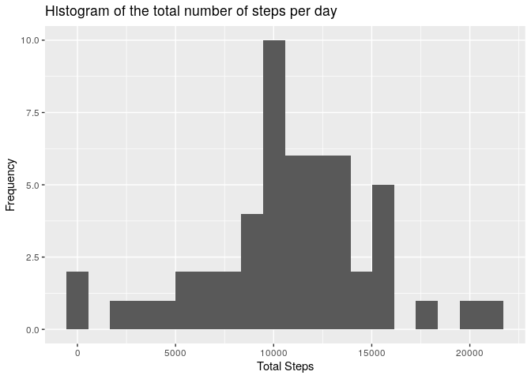
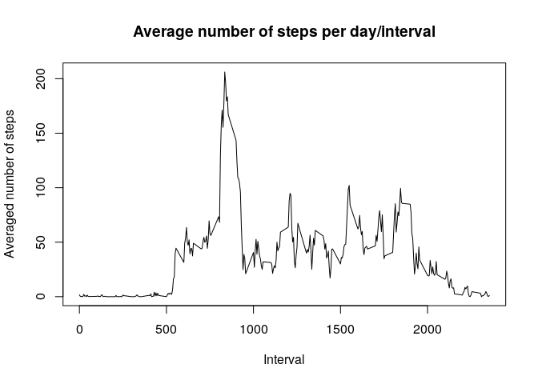
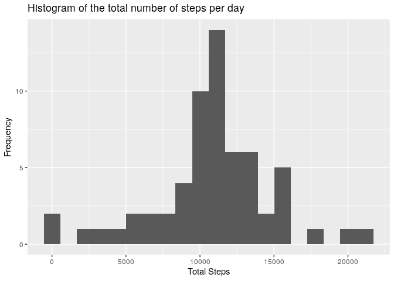
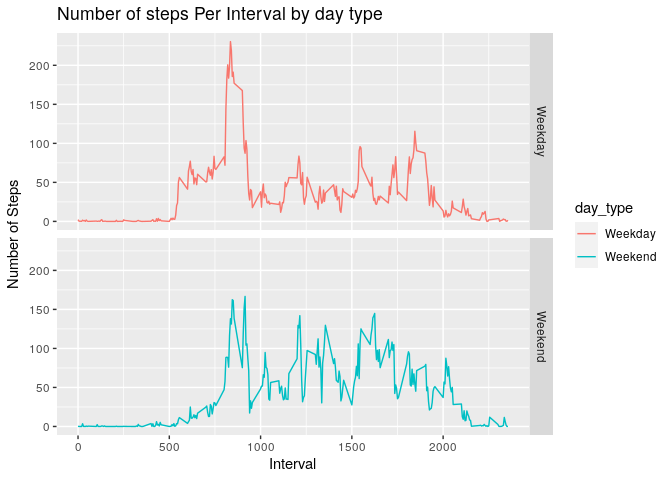

```r
knitr::opts_chunk$set(message = FALSE,warning = FALSE,echo=TRUE)
```

## Loading and preprocessing the data
Show any code that is needed to

1. Load the data (i.e. \color{red}{\verb|read.csv()|}read.csv())
2. Process/transform the data (if necessary) into a format suitable 
for your analysis


```r
myurl <- "https://github.com/rdpeng/RepData_PeerAssessment1/blob/master/activity.zip"
temp <- tempfile()
download.file(myurl, temp)
mydata <- read.csv("activity.csv")
head(mydata,n = 5)
```

```
##   steps       date interval
## 1    NA 2012-10-01        0
## 2    NA 2012-10-01        5
## 3    NA 2012-10-01       10
## 4    NA 2012-10-01       15
## 5    NA 2012-10-01       20
```


## What is mean total number of steps taken per day?

For this part of the assignment, we remove the missing values in the dataset.

1. Calculate the total number of steps taken per day
2. Make a histogram of the total number of steps taken each day
3. Calculate and report the mean and median of the total number of 
steps taken per day


```r
library(ggplot2)
library(plyr)
library(scales)
#omitting NA values
df <- na.omit(mydata)

#creating a dataframe for total steps per day 
df_sum <- ddply(df, "date", summarise, grp.sum=sum(steps,na.rm = TRUE))

#Histogram of the total number of steps per day
ggplot(df_sum,aes(grp.sum)) + geom_histogram(bins = 20) + ylab('Frequency') + 
  xlab('Total Steps') + 
  ggtitle('Histogram of the total number of steps per day')
```

<!-- -->


```r
daily_mean <- (mean(df_sum$grp.sum))
daily_median <- median(df_sum$grp.sum)
```
Considering that all NA values have been removed, the mean value of total steps
per day is 1.0766189\times 10^{4} and the respective median is 10765


## What is the average daily activity pattern?


1. Make a time series plot (i.e. \color{red}{\verb|type = "l"|}type = "l")
of the 5-minute interval (x-axis) and the average number of steps taken, 
averaged across all days (y-axis)
2. Which 5-minute interval, on average across all the days in the dataset,
contains the maximum number of steps?


```r
#omitting NA values
df <- na.omit(mydata)

#creating a dataframe for number of steps per 5-minute interval averaged across all days
interval_mean <- ddply(df, "interval", summarise, grp.sum=mean(steps,na.rm = TRUE))

# Plot the time series with appropriate labels and heading
plot(interval_mean$interval, interval_mean$grp.sum, type='l', col=1, 
     main="Average number of steps per day/interval", xlab="Interval", 
     ylab="Averaged number of steps")
```

<!-- -->

### Which 5-minute interval, on average across all the days in the dataset, 
contains the maximum number of steps?


```r
# Subset the interval which has the highest average steps
maxdf<-interval_mean[grep(max(interval_mean$grp.sum),interval_mean$grp.sum), ]
# Interval with max number of steps
max_step_interval<-maxdf[1,1]
# Max number of steps
max_step_mean<-maxdf[1,2]
```
Interval 835 has the maximum average number of 
steps 206.1698113.


## Imputing missing values
Note that there are a number of days/intervals where there are missing 
values (coded as NA). The presence of missing days may introduce bias into 
some calculations or summaries of the data.

1. Calculate and report the total number of missing values in the dataset 
(i.e. the total number of rows with NAs)

2. Devise a strategy for filling in all of the missing values in the dataset. 
The strategy does not need to be sophisticated. For example, you could use 
the mean/median for that day, or the mean for that 5-minute interval, etc.

3. Create a new dataset that is equal to the original dataset but with 
the missing data filled in.

4. Make a histogram of the total number of steps taken each day and Calculate 
and report the mean and median total number of steps taken per day. Do these 
values differ from the estimates from the first part of the assignment? 
What is the impact of imputing missing data on the estimates of the total 
daily number of steps?

### Calculate and report the total number of missing values in the dataset 
(i.e. the total number of rows with NAs).

```r
# Counting thenumber of NA values
na_count<-sum(is.na(mydata$steps))
```

There are 2304 rows with NA values in the dataset

### Filling Missing Values

We will replace the NA values with the 5-minute interval median

```r
# creating a new dataframe to store the filled NA version
nadf<-mydata

#loop through all rows of the dataset;
#Identify which ones are NA;
#Identify the interval index;
#fill the respective NA value with the mean of it's respective 5-minute interval.
for (i in 1:nrow(nadf)){
  if (is.na(nadf$steps[i])){
    value <- nadf$interval[i]
    row_id <- which(interval_mean$interval == value)
    steps_value <- interval_mean$grp.sum[row_id]
    nadf$steps[i] <- steps_value
  }
}
```

## Histogram of dataset with filled NA values


```r
#creating a dataframe for total steps per day 
nafill <- ddply(nadf, "date", summarise, grp.sum=sum(steps,na.rm = TRUE))

#Histogram of the total number of steps per day
ggplot(nafill,aes(grp.sum)) + geom_histogram(bins = 20) + ylab('Frequency') + 
  xlab('Total Steps') + ggtitle('Histogram of the total number of steps per day')
```

<!-- -->

### Mean and median of NA filled dataset


```r
nafill <- ddply(nadf, "date", summarise, grp.sum=sum(steps,na.rm = TRUE))
daily_mean_na <- (mean(nafill$grp.sum))
daily_median_na <- median(nafill$grp.sum)
```
Considering that all NA values have been filled, the mean value of total steps
per day is 1.0766189\times 10^{4} and the respective median is 1.0766189\times 10^{4}.
When the NA values were omitted the mean was 1.0766189\times 10^{4} and the median was 
10765. There is little to no change at these values, that is because 
of how we filled the NA values (using 5-minute intervals means across all days).


## Are there differences in activity patterns between weekdays and weekends?
For this part the weekdays() function may be of some help here. Use the dataset
with the filled-in missing values for this part.

1. Create a new factor variable in the dataset with two 
levels – “weekday” and “weekend” indicating whether a given date is a 
weekday or weekend day.

2. Make a panel plot containing a time series plot (i.e. type = “l”) of 
the 5-minute interval (x-axis) and the average number of steps taken, 
averaged across all weekday days or weekend days (y-axis). See the README file
in the GitHub repository to see an example of what this plot should look 
like using simulated data.

Determining if the day is a weekday or not

```r
# setting locale for US 
Sys.setlocale("LC_TIME", "C")
```

```
## [1] "C"
```

```r
weekday <- function(d) {
    wd <- weekdays(as.Date(d, '%Y-%m-%d'))
    if  (!(wd == 'Saturday' || wd == 'Sunday')) {
        x <- 'Weekday'
    } else {
        x <- 'Weekend'
    }
    x
}
```

Apply the weekday function to our NA filled dataset and make plots


```r
# Apply the weekday function and add a new column to nadf dataset
nadf$day_type <- as.factor(sapply(nadf$date, weekday))

# Create the aggregated data frame by intervals and day type
interval_mean_nafilled <- aggregate(steps ~ interval+day_type, nadf, mean)

weekday_plt <- ggplot(interval_mean_nafilled, aes(interval, steps)) +
    geom_line(stat = "identity", aes(colour = day_type)) +
    facet_grid(day_type ~ ., scales="fixed", space="fixed") +
    labs(x="Interval", y=expression("Number of Steps")) +
    ggtitle("Number of steps Per Interval by day type")
print(weekday_plt)
```

<!-- -->

There are some diferences between the average of steps between weekdays and 
weekend days. Notably, it seems that the user starts walking a bit later in the 
morning on weekend days. It also seems that, in afternnons, the user walks a 
little more on weekends. 
